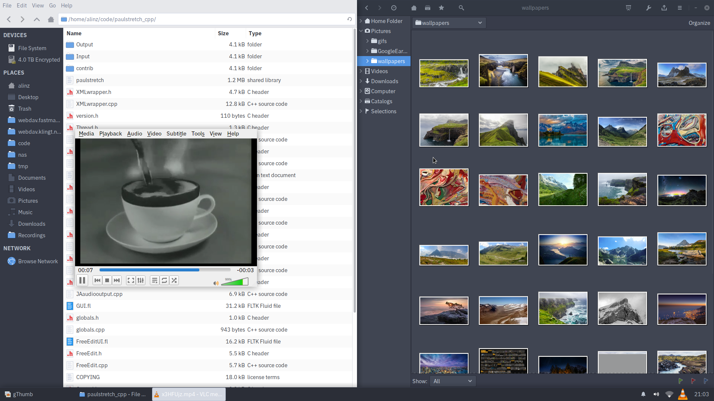
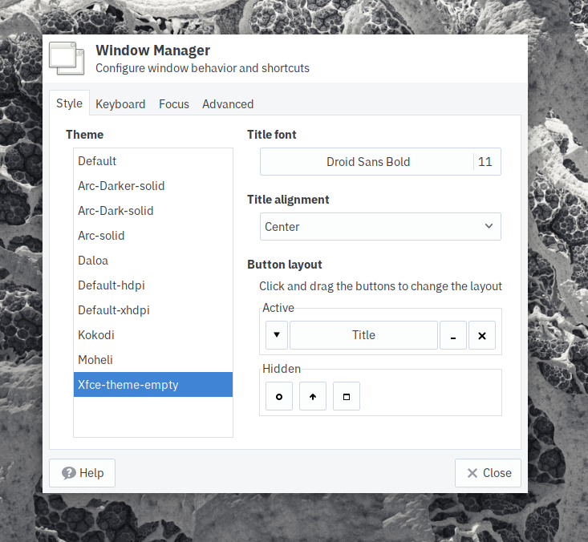

# Xfce Theme Empty

The most minimalistic window manager theme for Xfce because there are *no* window borders at all!



## Installation

```sh
# make install
```



## Uninstallation

```sh
# make uninstall
```
